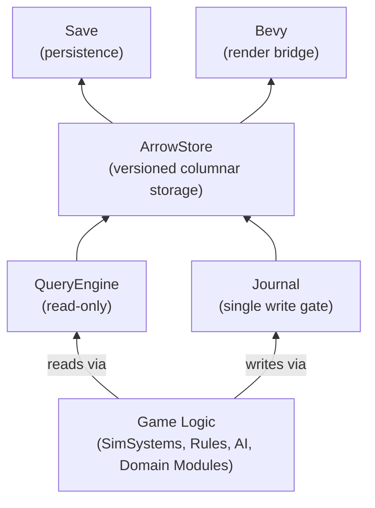

# Scharnhorst

**A deterministic simulation engine for provable grand-strategy worlds.**

Scharnhorst is a Rust simulation engine purpose-built for grand-strategy games where **determinism is not optional** — it is a first-class architectural constraint. Every tick must be provable. Save files are forensic artifacts. Multiplayer desyncs are debugged with binary-search precision, not shrugged off.

The engine is named after [Gerhard von Scharnhorst](https://en.wikipedia.org/wiki/Gerhard_von_Scharnhorst), a Prussian military reformer who understood that rigorous institutional process outlasts any single genius. The same applies to simulation: well-enforced invariants beat clever hacks.

---

## Why Scharnhorst?

Most game engines treat determinism as a nice-to-have — something you "try to maintain" while finishing features. Scharnhorst inverts this:

- **Determinism is the foundation**, not an afterthought. A non-deterministic tick is a bug, not a feature.
- **All world-state mutations flow through a single journal**. No component writes to storage directly. The journal is both the write gate and the replay log.
- **Save/load is a round-trip proof**. A saved game can be reloaded, replayed, and verified against the original run's hash chain down to the individual diff.
- **Content modding is a first-class interface**, not a file-system convention. Mods declare their contracts (tables, columns, rules) and the engine validates them at load time with compiler-grade error messages.

---

## Project Status

| Layer | Status |
|-------|--------|
| `scharnhorst_core` — types, IDs, FixedPoint, Diffs | ✅ Stable |
| `scharnhorst_schema` — tables, fields, relations, registry | ✅ Stable |
| `scharnhorst_arrow_store` — versioned Arrow tables, snapshots, indexing | ✅ Stable |
| `scharnhorst_journal` — command/diff submission, atomic commit | ✅ Stable |
| `scharnhorst_query` — DataFusion SQL, typed columnar access, inspector | ✅ Stable |
| `scharnhorst_content` — compilation, lifecycle, overlays, name resolution | ✅ Stable |
| `scharnhorst_save` — snapshot persistence, checkpoint, load reconstruction | ✅ Stable |
| `scharnhorst_scheduler` — phase-based execution, deterministic RNG, signals | ✅ Stable |
| `scharnhorst_rules` — expression evaluator, modifiers, scopes, effects | ✅ Stable |
| `scharnhorst_bevy` — entity materialisation, input bridge, refresh sync | ✅ Stable |
| `scharnhorst_integration_tests` | ✅ Exists |
| **Phase 0** — Enforce invariants (single-write gate, tiered state, schema freeze) | ⬜ Not started |
| **Phase 1+** — Observability, rule diagnostics, mod pipeline, replay proof | ⬜ Not started |

---

## Architecture



### Core Crates

| Crate | Responsibility |
|-------|---------------|
| **[`scharnhorst_core`](./scharnhorst_core)** | Foundational types: `FixedPoint` (deterministic i64-based decimal), `Tick`, `TableId`, `RowId`, `Diff`/`DiffBatch`, `RowPositionMap`. Zero dependencies beyond serde. |
| **[`scharnhorst_schema`](./scharnhorst_schema)** | Table definitions (`TableSpec`, `ColumnSpec`), `FieldSemantic` (Id, Name, ForeignKey, Quantity, etc.), `SchemaRegistry` (Freeze-aware registry with six-phase lifecycle), `RelationGraph` (cycle-detecting directed edges between tables). |
| **[`scharnhorst_arrow_store`](./scharnhorst_arrow_store)** | Versioned columnar storage via Apache Arrow. Each table stores tick-keyed `RecordBatch` generations. Supports `AppendOnly` and `Patchable` mutation modes, primary/foreign key indices, spatial partitioning, snapshot generation, and checkpointing to IPC files. |
| **[`scharnhorst_journal`](./scharnhorst_journal)** | **The single write entry point.** All world-state mutations flow through `Journal::submit_diff()` and are applied atomically via `commit()`. Produces a `CommitRecord` with a deterministic state hash. Attachable `SaveJournal` for incremental persistence. Debug builds include a `DebugWriteJournal` that routes SQL DML through the commit path. |
| **[`scharnhorst_query`](./scharnhorst_query)** | The exclusive read interface. Provides `TypedColumnAccess` (zero-copy Arrow column views), a `UnifiedReadSource` trait, a DataFusion-backed SQL context (for ad-hoc `SELECT` queries), a row-level `lookup_row` API, and an `InspectorConsole` for developer tooling. |
| **[`scharnhorst_scheduler`](./scharnhorst_scheduler)** | Phase-based simulation scheduler with strict ordering: `PreTick → Economy → Diplomacy → Military → PostTick`. Each system receives a deterministic RNG seeded from (system_id, tick). Systems declare read/write tables; the scheduler detects write conflicts within a phase. A `RefreshSignalBus` broadcasts a tick-complete signal to consumers (Bevy bridge, save manager, etc.). |
| **[`scharnhorst_rules`](./scharnhorst_rules)** | Expression IR (`Expr` AST with 15 variants: constants, comparisons, arithmetic, if-then-else, calls, lists, maps), `Evaluator` (pure function over world snapshot), `Scope`/`ScopeJump` for relation-traversal (e.g., "from province → owner actor"), `Modifier` aggregation chain, and a `PrefetchCache` for batch evaluation. |
| **[`scharnhorst_content`](./scharnhorst_content)** | Content compilation pipeline: parses raw table definitions (TOML), runs name resolution, applies `OverlayResolver` with configurable `MergeStrategy` (Replace, Merge, Append, Error), produces a `CompilationOutput`. Manages the six-phase `LoadLifecycle`. Generates `ModFingerprint` for compatibility checking. |
| **[`scharnhorst_save`](./scharnhorst_save)** | Full save/load stack: `SnapshotPersistence` (IPC serialization), `CheckpointManager` with retention policies, `SnapshotManager` for incremental snapshots, `LoadReconstruction` with six-phase cold start, `MigrationPipeline` for schema evolution, and `ModToleranceChecker` for handling save/mod mismatches. |
| **[`scharnhorst_bevy`](./scharnhorst_bevy)** | Bevy engine bridge: `InputCommandBuffer` / `CommandSource` for feeding player commands into the journal, entity `materialize`/`dematerialize` for mapping Arrow table rows to Bevy ECS components, `SnapshotRefreshHandler` for reacting to tick-complete signals, and `ViewModel` / `SyncField` for reactive component syncing. |
| **[`scharnhorst_integration_tests`](./scharnhorst_integration_tests)** | Shared test harness and full-stack integration tests covering MVP scenarios, save/load round-trips, determinism, Bevy sync, and schema freeze. |

### Key Design Principles

1. **Single-Write-Entry-Point Invariant**  
   During simulation, all world-state mutations go through `scharnhorst_journal`. No system holds a write handle to `ArrowStore` — only the `Journal` can apply diffs. This makes every mutation auditable, replayable, and reversible.

2. **Three-Tier State Model**  
   - **Authority** (Arrow `RecordBatch` via `VersionedTable`): persists across ticks, serialised in saves. Economy tables, diplomacy relations, military units.  
   - **Derived** (custom structures, recomputed per tick): map-mode heatmaps, AI score grids, materialised views. Rebuildable from authority data.  
   - **Ephemeral** (Bevy ECS components, local heaps): UI hover, pathfinding queues, animation state. Discarded every tick.

3. **Deterministic by Construction**  
   - `FixedPoint` arithmetic (i64-based, platform-independent) for all simulation math.  
   - Per-system, per-tick seeded `DeterministicRng` for all randomness.  
   - Tick boundary: consume commands → run phases → atomic commit → broadcast refresh.  

4. **Phase-Guarded Lifecycle**  
   The **six-phase load lifecycle** ensures safe cold-start:  
   `SnapshotDeserialize → ModCoordination → SchemaMigration → ContentCompilation → SchemaFreeze → SimulationStart`  
   The schema registry is frozen before the first tick; no `create_table` during simulation.

5. **Content as Contract**  
   Content mods declare their tables, columns, relations, and rules in a structured manifest format. The overlay system resolves conflicts with configurable strategies. The fingerprint registry tracks mod versions for safe save/load across mod sets.

---

## Roadmap

The full roadmap is in [ROADMAP.md](./ROADMAP.md). High-level phases:

| Phase | Theme | Status |
|-------|-------|--------|
| **0** | Fortify the invariants (type-system enforcement, tiered state, schema freeze) | ⬜ |
| **1** | Make the world observable (productionise query engine, SQL console, inspector panels, telemetry) | ⬜ |
| **2** | Content language & rule diagnostics (source-anchored errors, static analysis, rule debugger) | ⬜ |
| **3** | Mod & content pipeline (dependency resolution, overlay hardening, fingerprint-based tolerance) | ⬜ |
| **4** | Proof system: save, replay, and multiplayer as one system (deterministic replay, tick hash chain, desync forensics) | ⬜ |
| **5** | Developer tooling in the Bevy bridge (in-game inspector, map-mode query, content editor) | ⬜ |
| **6** | Domain modules (spatial, polity, population, economy, diplomacy, military, events, AI) | ⬜ |
| **7** | Vertical slice — a small but complete playable loop exercising every layer | ⬜ |

---

## Getting Started

```bash
# Build all crates
cargo build

# Run all tests
cargo test

# Build with optimizations
cargo build --release
```

**Minimum Rust version**: 1.78  
**Workspace package manager**: Cargo (resolver v2)

---

## License

Licensed under either of [MIT](./LICENSE-MIT) or [Apache-2.0](./LICENSE-APACHE) at your option.

---

*"Provable simulation is not a property of the runtime — it is a property of the architecture."*
